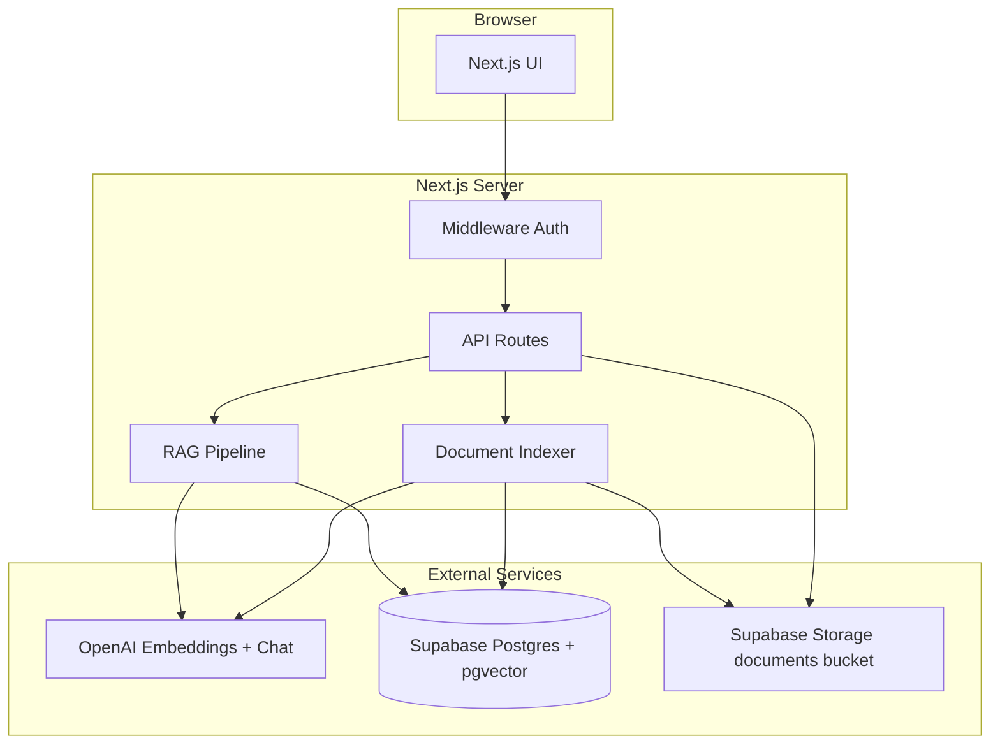
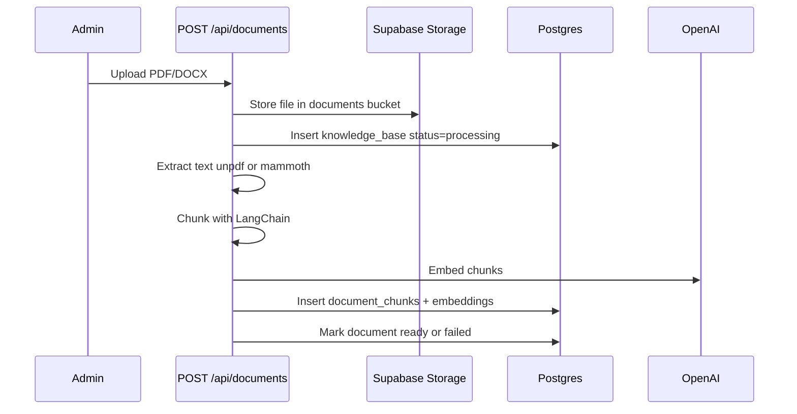
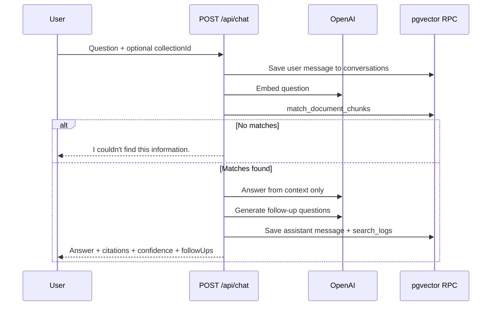

# AI Knowledge Assistant — Project Documentation

Complete overview of what this project is, how it is built, which technologies are used (and why), and how the system works end-to-end.

---

## 1. Project summary

**AI Knowledge Assistant** is an enterprise RAG (Retrieval-Augmented Generation) app. Employees upload company documents (PDF / DOCX), the system indexes them into a vector database, and users can:

- Semantically search across the knowledge base  
- Chat with an AI that answers **only from those documents**  
- See **citations** (document name + page + snippet)  
- Open the source file from a citation  
- Scope questions to a **collection** or a single document  
- Keep **chat history**, export answers, and (for admins) view **usage analytics**

**Goal:** Reduce “where is that policy?” hunting by turning internal documents into a trusted, cited Q&A assistant.

---

## 2. High-level architecture



### Request flow (chat)

1. User asks a question in the Dashboard chat.  
2. Middleware checks JWT session.  
3. `POST /api/chat` validates input, optionally scopes to a collection/document.  
4. Query is embedded with OpenAI.  
5. Supabase RPC `match_document_chunks` finds similar chunks (pgvector).  
6. GPT answers using **only** those chunks as context.  
7. Answer + citations + confidence + follow-ups are returned and saved to conversation history.

---

## 3. Tech stack — what we use and why

| Layer | Technology | Why we chose it |
|-------|------------|-----------------|
| App framework | **Next.js 16** (App Router) | Full-stack in one repo: UI + API routes + middleware. Fast to ship and deploy. |
| UI | **React 19** + **Tailwind CSS 4** | Modern component UI with utility styling; consistent admin/dashboard look. |
| Auth | **Auth.js (next-auth v5)** | Credentials + optional Google; JWT sessions; fits Next.js App Router. |
| Database | **Supabase PostgreSQL** | Managed Postgres with auth/storage ecosystem; easy SQL migrations. |
| Vectors | **pgvector** | Embeddings stay in the same DB as documents — no separate vector service. |
| File storage | **Supabase Storage** | Private bucket for original PDFs/DOCX; signed URLs for viewing. |
| AI chat | **OpenAI** (`gpt-4o-mini` default) | Reliable grounded answers at low cost for enterprise Q&A. |
| Embeddings | **OpenAI** (`text-embedding-3-small`) | 1536-dim vectors; good quality/cost for semantic search. |
| Chunking | **LangChain** `RecursiveCharacterTextSplitter` | Proven splitting (size 1000, overlap 200) for RAG quality. |
| PDF / DOCX parse | **unpdf** / **mammoth** | Extract text before embedding (serverless-safe). |
| Validation | **Zod** | Runtime validation for env vars and API bodies. |
| Schema docs | **Prisma schema** | Documents the data model; runtime queries use Supabase client (vectors + Storage). |
| Passwords | **bcryptjs** | Industry-standard hashing for credential login. |

---

## 4. Folder structure

```
ai-knowledge-assistant/
├── prisma/schema.prisma              # Canonical data model (docs / Prisma)
├── supabase/migrations/
│   ├── 001_initial.sql               # Core tables + pgvector RPC
│   └── 002_feature_wave.sql          # Conversations, collections, analytics fields
├── scripts/seed-admin.ts             # Create first admin user
├── src/
│   ├── middleware.ts                 # Auth gate + security headers
│   ├── auth.config.ts                # Edge-safe Auth.js config
│   ├── app/
│   │   ├── login/                    # Login page
│   │   ├── (app)/                    # Authenticated shell + sidebar
│   │   │   ├── dashboard/            # Search + chat
│   │   │   ├── document-workspace/   # Per-doc summarize / extract / chat
│   │   │   └── admin-settings/       # Upload, users, collections, analytics
│   │   └── api/                      # REST handlers
│   ├── components/                   # UI (chat, search, admin, uploader, …)
│   ├── lib/
│   │   ├── auth.ts                   # Auth.js providers + callbacks
│   │   ├── openai/rag.ts             # Retrieve + answer + follow-ups
│   │   ├── documents/indexer.ts      # Extract → chunk → embed → store
│   │   ├── security/                 # Encryption, rate limit, headers
│   │   └── supabase/                 # Service-role client
│   └── types/index.ts
└── README.md
```

---

## 5. Features (product)

### For all signed-in users (viewer + admin)

| Feature | What it does | Why it matters |
|---------|--------------|----------------|
| **Semantic search** | Finds relevant chunks by meaning, not just keywords | Users find policy text even with different wording |
| **Knowledge chat (RAG)** | Answers questions using retrieved document context | Feels like ChatGPT, but grounded in company docs |
| **Citations** | Shows document name, page, snippet | Builds trust; users can verify the answer |
| **Open source (PDF jump)** | Click citation → signed URL viewer (`#page=N` for PDF) | Jump from answer to the real file |
| **Suggested questions** | Chips on empty chat | Helps first-time users start asking |
| **Follow-up chips** | 3 related questions after each answer | Keeps conversation flowing |
| **Confidence badge** | High / Medium / Low from similarity score | Signals how strong the retrieval was |
| **Export / Copy** | Copy answer or download Markdown + sources | Share answers in docs or tickets |
| **Chat history** | Saved conversations in the sidebar | Resume past Q&A without retyping |
| **Collections scope** | Limit search/chat to a named group of docs | HR vs Legal vs Engineering knowledge sets |
| **Document workspace** | Summarize, extract metadata, ask about one doc | Deep work on a single file |

### Admin only

| Feature | What it does | Why it matters |
|---------|--------------|----------------|
| **Upload PDF/DOCX** | Drag-drop → store → index embeddings | Populate the knowledge base |
| **Upload progress + reindex** | Status stages + retry on failure | Recover from indexing errors |
| **Delete documents** | Removes DB rows + storage object | Keep KB clean |
| **Collections CRUD** | Create groups and attach documents | Organize knowledge for scoped RAG |
| **User management** | Create viewers/admins | Control who can access the system |
| **Usage analytics** | Queries, unanswered, top docs/queries | See gaps in the knowledge base |

---

## 6. How it works (pipelines)

### A. Upload → index



### B. Ask → answer (RAG)



### C. Auth & roles

- **viewer** — search, chat, workspace, view collections list, open files  
- **admin** — everything above + upload, delete, reindex, users, collections manage, analytics  

Sessions are **JWT**, short-lived (**15 minutes**), with role embedded in the token. Middleware blocks unauthenticated access and non-admins from `/admin-settings`.

---

## 7. Database model

| Table | Purpose |
|-------|---------|
| `users` | App users (name, email, password hash, role) |
| `knowledge_base` | Document metadata + encrypted storage path + status |
| `document_chunks` | Text chunks + `vector(1536)` embeddings |
| `search_logs` | Audit of chat/search queries (for analytics) |
| `conversations` | Chat threads per user |
| `messages` | User/assistant turns + citations JSON + confidence |
| `collections` | Named document groups |
| `collection_documents` | Many-to-many: collection ↔ document |

**RPC:** `match_document_chunks` — cosine similarity search; can filter by one document or a list (collections).

**Storage bucket:** `documents` (private, 20MB, PDF/DOCX only).

**Security note:** RLS is enabled with **no public policies**. The Next.js server uses the **service role** key; browsers never talk to the DB directly.

---

## 8. Main API routes

| Route | Role | Purpose |
|-------|------|---------|
| `/api/auth/[...nextauth]` | Public | Login / session |
| `/api/chat` | Auth | RAG Q&A + persist conversation |
| `/api/search` | Auth | Semantic search only |
| `/api/suggestions` | Auth | Suggested starter questions |
| `/api/conversations` | Auth | List / create chats |
| `/api/conversations/[id]` | Auth | Load / rename / delete |
| `/api/collections` | Auth (mutate: admin) | List / create collections |
| `/api/collections/[id]` | Admin | Update / delete |
| `/api/documents` | Auth / Admin upload | List / upload+index |
| `/api/documents/[id]` | Auth / Admin delete | Get / delete |
| `/api/documents/[id]/file` | Auth | 60s signed URL for viewer |
| `/api/documents/[id]/reindex` | Admin | Re-embed document |
| `/api/documents/[id]/summarize` | Auth | Bullet summary |
| `/api/documents/[id]/extract` | Auth | Structured metadata |
| `/api/admin/users` | Admin | User CRUD-ish list/create |
| `/api/admin/analytics` | Admin | Usage aggregates |

---

## 9. Security measures

| Control | Implementation |
|---------|----------------|
| Authentication | Auth.js JWT sessions |
| Authorization | Role checks in middleware + `requireSession({ roles })` |
| Password storage | bcrypt hashes |
| Path secrecy | AES-256-GCM encrypted `file_path` in DB |
| File access | Private bucket + short-lived signed URLs |
| Input safety | Zod schemas on APIs |
| Abuse control | Per-user in-memory rate limits |
| Network headers | CSP and security headers on responses |
| Grounding | System prompt forces answers from context only |
| Google SSO | Only if email already exists in `users` (no open signup) |

---

## 10. Environment variables

Copy `.env.example` → `.env.local`:

| Variable | Required | Purpose |
|----------|----------|---------|
| `AUTH_SECRET` | Yes | Auth.js signing secret (≥32 chars) |
| `AUTH_URL` | Recommended | App URL (e.g. `http://localhost:3000`) |
| `ENCRYPTION_KEY` | Yes | 64 hex chars for path encryption |
| `NEXT_PUBLIC_SUPABASE_URL` | Yes | Supabase project URL |
| `SUPABASE_SERVICE_ROLE_KEY` | Yes | Server-side DB/Storage access |
| `OPENAI_API_KEY` | Yes | Embeddings + chat |
| `OPENAI_CHAT_MODEL` | No | Default `gpt-4o-mini` |
| `OPENAI_EMBEDDING_MODEL` | No | Default `text-embedding-3-small` |
| `GOOGLE_CLIENT_ID` / `SECRET` | No | Optional Google login |

---

## 11. Local setup

1. Create a Supabase project.  
2. Run SQL in order in the SQL Editor:  
   - `supabase/migrations/001_initial.sql`  
   - `supabase/migrations/002_feature_wave.sql`  
3. Fill `.env.local`.  
4. Install and seed:

```bash
npm install
npm run seed:admin
npm run dev
```

5. Open `http://localhost:3000`  
   - Default admin (from seed): see `README.md` / seed script defaults  
6. Admin → upload a PDF → Dashboard → ask a question  

---

## 12. Pages map

| URL | Who | What you see |
|-----|-----|--------------|
| `/login` | Public | Email/password (+ Google if configured) |
| `/dashboard` | Auth | Semantic search, chat history, collections picker, RAG chat |
| `/document-workspace` | Auth | Pick a document → summarize / extract / scoped chat |
| `/admin-settings` | Admin | Analytics, upload, documents, collections, users |

---

## 13. Design principles used in this project

1. **Grounded answers** — The model must use retrieved context; otherwise it says it couldn’t find the information.  
2. **Citations first** — Every useful answer should be checkable against a source.  
3. **Least privilege** — Viewers consume knowledge; only admins change the knowledge base.  
4. **Server-owned secrets** — Service role key, encryption key, and OpenAI key never go to the browser.  
5. **Same DB for vectors and metadata** — Simpler ops than a separate vector DB for this product size.

---

## 14. Out of scope (future ideas)

Not in the current build (possible later waves):

- Voice input  
- Weekly digests / “what’s new”  
- Side-by-side multi-doc compare UI  
- Dark mode redesign  
- Extra file types (PPTX, CSV, Markdown)  
- Department-level ACL beyond collections  

---

*This document describes the codebase as of the Attractive Features Wave (Option 2): chat history, citation viewer, suggestions/follow-ups, collections, admin analytics, and polish (confidence, export, upload retry).*
