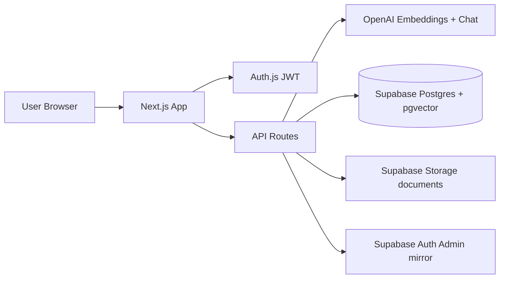
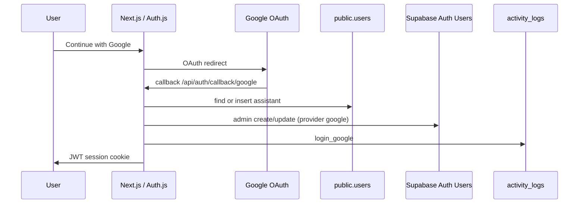

# AI Knowledge Assistant

Enterprise **RAG** (Retrieval-Augmented Generation) knowledge assistant for internal company documents.

Upload PDFs/DOCX → index with OpenAI embeddings → ask natural questions → get **grounded answers with citations** (document + page + snippet).

**Stack:** Next.js 16 · React 19 · Tailwind 4 · Auth.js · Supabase (Postgres + pgvector + Storage + Auth mirror) · OpenAI

---

## Why RAG?

Plain ChatGPT **does not know your company policies** unless you paste them into every prompt (insecure, incomplete, does not scale).

| Approach | Problem |
|----------|---------|
| GPT only (no docs) | Hallucinates; invents policies from public knowledge |
| Stuff full PDFs into every prompt | Too large, expensive, slow; no page-level citations |
| Keyword search only | Misses phrasing like “annual leave” vs “vacation policy” |

**RAG** solves this:

1. **Retrieve** the most relevant chunks from *your* indexed documents (embeddings + pgvector).
2. **Augment** the LLM prompt with only those chunks.
3. **Generate** an answer that stays faithful to that context, with inline sources.

---

## App pages (sidebar)

| Page | Route | What you can do |
|------|--------|-----------------|
| **Dashboard** | `/dashboard` | Intro, **semantic search**, Knowledge Chat (history, collections, citations, confidence, copy/export) |
| **Documents** | `/document-workspace` | **Upload** PDF/DOCX, then **Summarize**, **Extract metadata**, or ask questions scoped to one document |
| **Admin Settings** | `/admin-settings` | Reindex/delete docs, collections, users, usage analytics + activity by role |

### Roles

| Role | How you get it | Access |
|------|----------------|--------|
| **admin** | Email + password login (seeded admin, or created in Admin → Users) | All pages: Dashboard, Documents, Admin Settings |
| **assistant** | **Google SSO** (auto-provisioned on first Google login) | Dashboard + Documents (upload, chat, search, summarize). **No** Admin Settings |

Sessions last **8 hours** (JWT). Role is refreshed from the database on each request so permission changes apply after the next navigation.

Sidebar shows the current role badge (`admin` / `assistant`).

---

## Architecture



### Auth model (Auth.js primary · Supabase Auth mirror)

Login is handled by **Auth.js**, not Supabase Auth sessions.

| Method | App (`public.users`) | Supabase **Authentication → Users** |
|--------|----------------------|-------------------------------------|
| Email + password | `role = admin` (or whatever you set) · `password_hash` set | `provider: email` · metadata `role: admin`, `login_method: email` |
| Google SSO | `role = assistant` · no password | `provider: google` · metadata `role: assistant`, `login_method: google` |

Same UUID is used in `public.users.id` and Supabase Auth `users.id` when possible.



Do **not** enable Google under Supabase Auth → Providers — this app does not use it.

### Activity & audit trail

Every meaningful action is logged so you can see **who** did **what** and with which **role**:

| Store | Purpose |
|-------|---------|
| `activity_logs` | Full trail: `login_google`, `login_credentials`, `search`, `chat`, `upload`, `summarize`, `extract`, … with `user_email` + `user_role` |
| `search_logs` | Search/chat queries + hits; also stores `user_email` + `user_role` |

View in Supabase **Table Editor → `activity_logs`**, or in-app under **Admin Settings → Usage analytics → Recent activity by role**.

### RAG pipeline

1. **Parse** — PDF page-by-page (`pdf-parse`) or DOCX (`mammoth`).
2. **Chunk** — page-aware windows (~250 words, 40 overlap).
3. **Embed** — OpenAI `text-embedding-3-small` (batched) → 1536-d vectors.
4. **Store** — `document_chunks` + Storage object; `knowledge_base.status` = `processing` → `ready` / `failed`.
5. **Retrieve** — embed the question → RPC `match_document_chunks` → keep cosine similarity threshold (app filters ≈ **0.55**).
6. **Answer** — multi-turn history + grounded system prompt; greetings allowed without fake citations.

Upload returns immediately after Storage + DB insert; **indexing runs in the background**. The uploader polls until `ready` or `failed`.

Auth gate: [`src/proxy.ts`](src/proxy.ts). Login and `/api/auth/*` are excluded so Auth.js routes do not 404.

---

## Features ↔ APIs ↔ data

| Feature | UI / route | Data |
|---------|------------|------|
| Email login | `/login` → credentials | `users` + JWT · Auth mirror as **admin** · `activity_logs` |
| Google login | `/login` → Google | `users` as **assistant** · Auth mirror `provider: google` · `activity_logs` |
| Semantic search | Dashboard → `POST /api/search` | `document_chunks` · `search_logs` · `activity_logs` |
| RAG chat | Dashboard → `POST /api/chat` | `conversations`, `messages`, `search_logs`, `activity_logs` |
| Upload + index | Documents (or Admin) → `POST /api/documents` | Storage `documents` + `knowledge_base` · `activity_logs` |
| Summarize / extract | Documents workspace | OpenAI + `activity_logs` |
| Collections | Admin + chat/search scope | `collections`, `collection_documents` |
| Users / analytics | Admin only | `users`, `search_logs`, `activity_logs` |

### Database (migrations)

| File | Purpose |
|------|---------|
| [`001_initial.sql`](supabase/migrations/001_initial.sql) | Extensions, `users`, KB, chunks, search RPC, storage bucket |
| [`002_feature_wave.sql`](supabase/migrations/002_feature_wave.sql) | Conversations, messages, collections, enriched logs |
| [`005_clean_reset.sql`](supabase/migrations/005_clean_reset.sql) | **Recommended** full rebuild (UUID schema + RPC + `documents` bucket) |
| [`006_assistant_role_and_activity.sql`](supabase/migrations/006_assistant_role_and_activity.sql) | Role `viewer` → `assistant`, `activity_logs`, enriched `search_logs` |

`users.id` **must be `uuid`**. Non-UUID ids break foreign keys for chat.

Runtime uses the **Supabase service-role client** (not Prisma at request time). [`prisma/schema.prisma`](prisma/schema.prisma) documents the model shape only.

**Core tables:** `users`, `knowledge_base`, `document_chunks`, `conversations`, `messages`, `collections`, `collection_documents`, `search_logs`, `activity_logs`  
**Storage bucket:** `documents` (private, PDF/DOCX, 20MB)  
**RPC:** `match_document_chunks`

---

## Environment

Copy [`.env.example`](.env.example) → `.env.local`:

| Variable | Used for |
|----------|----------|
| `AUTH_SECRET` | Auth.js signing (≥32 chars) |
| `AUTH_URL` | App URL (`http://localhost:3000`) |
| `ENCRYPTION_KEY` | AES-256-GCM for storage paths (64 hex chars) |
| `NEXT_PUBLIC_SUPABASE_URL` | Supabase project URL |
| `SUPABASE_SERVICE_ROLE_KEY` | Server DB + Storage + Auth Admin (**never expose to browser**) |
| `OPENAI_API_KEY` | Embeddings + chat + summarize/extract |
| `OPENAI_CHAT_MODEL` | Default `gpt-4o-mini` |
| `OPENAI_EMBEDDING_MODEL` | Default `text-embedding-3-small` |
| `GOOGLE_CLIENT_ID` / `GOOGLE_CLIENT_SECRET` | Google SSO (“Continue with Google”) |

Optional seed overrides: `SEED_ADMIN_EMAIL`, `SEED_ADMIN_PASSWORD`, `SEED_ADMIN_NAME`.

Never commit `.env.local`.

---

## Setup (from zero)

### 1. Env

1. Create a [Supabase](https://supabase.com/dashboard) project.
2. **Project Settings → API Keys → Legacy** → copy Project URL + **service_role** key.
3. Fill `.env.local` (Auth secret, encryption key, OpenAI, Supabase, optional Google).

### 2. Database

In **SQL Editor**, paste **file contents** (not the path).

**Fresh project (recommended):**

1. Run [`005_clean_reset.sql`](supabase/migrations/005_clean_reset.sql) once.  
2. Run [`006_assistant_role_and_activity.sql`](supabase/migrations/006_assistant_role_and_activity.sql) once.

Confirm **Table Editor**: `users`, `knowledge_base`, `document_chunks`, `conversations`, `messages`, `collections`, `activity_logs`.  
Confirm `users.id` type is **uuid** and roles are `admin` | `assistant`.

### 3. Install & run

```bash
npm install
npm run seed:admin
npm run dev
```

Open [http://localhost:3000/login](http://localhost:3000/login).

| Login | Result |
|-------|--------|
| Email admin | `admin@example.com` / `ChangeMeNow1!` → role **admin** |
| Google | Continue with Google → role **assistant** |

After any `.env.local` change, **fully restart** `npm run dev`.

### 4. Smoke test

1. **Admin** login → sidebar shows Admin Settings + role `admin`.
2. **Documents** → upload PDF/DOCX → wait until status is `ready`.
3. **Dashboard** → semantic search + Knowledge Chat.
4. Sign out → **Google** login → role `assistant` (no Admin Settings); upload/chat still work.
5. Supabase → **Authentication → Users**: Google user shows provider **google** + metadata `role: assistant`; email admin shows **email** + `role: admin`.
6. Supabase → **Table Editor → `activity_logs`**: login / search / chat / upload rows with `user_role`.

### Google SSO setup

1. [Google Cloud Console](https://console.cloud.google.com/) → OAuth consent screen.  
2. Credentials → OAuth client **Web application**:
   - Origins: `http://localhost:3000`
   - Redirect: `http://localhost:3000/api/auth/callback/google`
3. Put Client ID + Secret in `.env.local`, restart.  
4. Do **not** enable Google under Supabase Auth → Providers.

---

## Deploy on Vercel

This repo includes [`vercel.json`](vercel.json) (Next.js framework + `iad1` region). Heavy API routes also export `maxDuration` for RAG / upload / summarize.

### 1. Push to GitHub

Connect the repo in [Vercel](https://vercel.com/new) → **Import** → Framework: **Next.js** (auto-detected).

### 2. Environment variables

In Vercel → Project → **Settings → Environment Variables**, add the same keys as `.env.local`:

| Variable | Notes |
|----------|--------|
| `AUTH_SECRET` | ≥32 chars |
| `AUTH_URL` | **Must be** `https://YOUR_APP.vercel.app` (or custom domain). If you paste `http://localhost:3000` here, login redirects stay on localhost. |
| `ENCRYPTION_KEY` | 64 hex chars |
| `NEXT_PUBLIC_SUPABASE_URL` | Supabase project URL |
| `SUPABASE_SERVICE_ROLE_KEY` | service_role secret |
| `OPENAI_API_KEY` | required |
| `OPENAI_CHAT_MODEL` | optional |
| `OPENAI_EMBEDDING_MODEL` | optional |
| `GOOGLE_CLIENT_ID` / `GOOGLE_CLIENT_SECRET` | optional but needed for Google SSO |

Apply to **Production** (and Preview if you want Google on preview URLs).

### 3. Google OAuth (production)

In Google Cloud Console OAuth client, **also** add:

- Origin: `https://YOUR_APP.vercel.app`
- Redirect: `https://YOUR_APP.vercel.app/api/auth/callback/google`

### 4. Deploy & seed

1. Deploy from Vercel (or `npx vercel --prod` with CLI).
2. After first deploy, run seed against the same Supabase project (locally is fine):

```bash
npm run seed:admin
```

3. Open the Vercel URL → login with admin or Google.

### Notes

- **Request body size:** Vercel serverless limits upload payload size by plan (Hobby is smaller than the app’s 20MB local limit). Prefer smaller PDFs on Hobby, or upgrade if you need large uploads.
- After changing env vars, **Redeploy** so the new values load.
- Keep using the same Supabase project URL/key you configured locally.

---

## Troubleshooting

| Symptom | Cause | Fix |
|---------|--------|-----|
| SQL error near `"supabase"` | Pasted file **path** | Paste SQL **contents** only |
| `unterminated dollar-quoted string` + injected RLS | Supabase editor injects RLS into `$$` bodies | Use `005_clean_reset.sql` (tagged `$fn$`) or smaller scripts |
| `invalid input syntax for type uuid: "cmrz…"` | `users.id` is CUID/`text` | Run [`005_clean_reset.sql`](supabase/migrations/005_clean_reset.sql) |
| `relation "users_email_idx" already exists` | Rename left old index names | Use current `005` (drops users cleanly) or drop leftover indexes |
| `Could not choose the best candidate function` for `match_document_chunks` | Old 3-arg + new 4-arg overloads | Drop both, recreate from `005` / `006` era SQL |
| `permission denied for schema public` | Missing grants | Run grants in `005` |
| Google → AccessDenied | DB insert/select failed | Check terminal `Google sign-in failed:`; fix schema; restart |
| Google user still shows `admin` | Old session / old data | Sign out → Google again; ensure `006` ran (Google-only → `assistant`) |
| Assistant cannot open Admin Settings | Expected | Admin Settings is **admin**-only |
| Chat “Internal server error” | Missing chat tables | Run `005` then `006` |
| Documents empty | No uploads yet | Documents → upload until `ready` |
| PDF citation iframe blank | CSP | App sets `frame-src` for `*.supabase.co` |

---

## Production-oriented behavior (shipped)

- Route `loading.tsx` / `error.tsx` / `global-error.tsx`
- Background document indexing + client status polling
- Chat: auto-scroll, stop, retry, 401 → login, multi-turn history
- Search on Dashboard with empty/no-results states
- Upload: rejected-file messages, clearer progress stages
- API: JSON body guard (400), `Retry-After` on 429, clearer PostgREST logs
- Activity logging for logins and knowledge actions by role
- Doc viewer: dialog semantics, Escape, backdrop close
- CSP allows Supabase Storage frames for PDF preview

---

## Folder map

```
src/
  proxy.ts                 # Auth gate + security headers
  auth.config.ts           # Edge-safe Auth.js (session length)
  app/
    login/
    (app)/                 # Dashboard · Documents · Admin
      loading.tsx error.tsx
    api/                   # chat, search, documents, conversations, collections, admin
    global-error.tsx
  components/              # chat, search, document, admin, uploader, sidebar, ui
  lib/
    auth.ts activity.ts session.ts api.ts
    openai/ rag.ts client.ts
    documents/ indexer, chunking, parser
    supabase/ admin.ts auth-users.ts
supabase/migrations/       # 001 … 005_clean_reset, 006_assistant_role_and_activity
scripts/
  seed-admin.ts            # Seed email admin (+ keep Google users as assistants)
  check-db.ts              # Health check
  list-users.ts            # List public.users + Auth users
  resync-auth-users.ts     # Align Auth UUIDs / metadata with public.users
```

---

## Scripts

| Command | Purpose |
|---------|---------|
| `npm run dev` | Local Next.js (Turbopack) |
| `npm run build` / `npm start` | Production build & serve |
| `npm run seed:admin` | Create/update email admin; password users → admin; Google-only → assistant |
| `npm run lint` | ESLint |
| `npx tsx scripts/check-db.ts` | Verify tables, RPC, storage, admin row |
| `npx tsx scripts/list-users.ts` | Print app + Auth users |
| `npx tsx scripts/resync-auth-users.ts` | Recreate Auth users to match `public.users` ids/roles |

---

## Security (summary)

- JWT sessions (8h) · RBAC (`admin` / `assistant`) · bcrypt passwords  
- Google SSO via Auth.js · mirrored to Supabase Auth with provider + role metadata  
- Activity trail (`activity_logs`) for who used the app and as which role  
- Zod validation · in-memory rate limits · AES path encryption  
- Private Storage · service-role server-only · security headers via proxy  

---

## License

Private project — all rights reserved unless otherwise stated.
