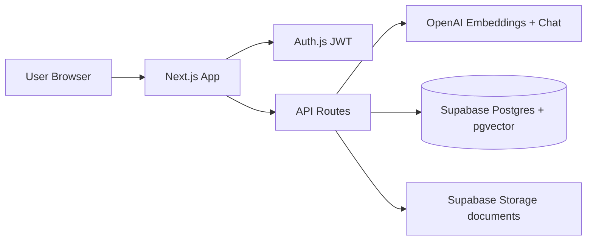

# AI Knowledge Base

Enterprise **RAG** (Retrieval-Augmented Generation) knowledge assistant for internal company documents.

Upload PDFs/DOCX → index with OpenAI embeddings → ask natural questions → get **grounded answers with citations** (document + page + snippet).

**Stack:** Next.js 16 · React 19 · Tailwind 4 · Auth.js · Supabase (Postgres + pgvector + Storage) · OpenAI

---

## Why RAG?

Plain ChatGPT **does not know your company policies** unless you paste them into every prompt (which is insecure, incomplete, and does not scale).

| Approach | Problem |
|----------|---------|
| GPT only (no docs) | Hallucinates; invents policies from public knowledge |
| Stuff full PDFs into every prompt | Too large, expensive, slow; no page-level citations |
| Keyword search only | Misses phrasing like “annual leave” vs “vacation policy” |

**RAG** solves this:

1. **Retrieve** the most relevant chunks from *your* indexed documents (semantic search via embeddings + pgvector).
2. **Augment** the LLM prompt with only those chunks.
3. **Generate** an answer that must stay faithful to that context, with inline sources.

So employees get fast, source-backed answers instead of hunting through folders — and admins keep control over what is in the knowledge base.

---

## What we built (product overview)

| Area | What it does |
|------|----------------|
| **Login** | Email/password (bcrypt). Optional Google OAuth if envs are set. 15-minute JWT sessions. Roles: `viewer` / `admin`. |
| **Dashboard** | Product intro + **knowledge chat**: collections scope, conversation history, citations, confidence, follow-ups, export/copy. |
| **Document workspace** | Pick one doc → summarize, extract metadata, or ask scoped questions. |
| **Admin settings** | Upload/reindex/delete documents, collections, create users, usage analytics. |
| **UI** | Teal + amber theme, dark mode, full-height collapsible sidebar, Framer Motion animations, brand logo + intro imagery. |

### Roles

- **Viewer** — chat, search, document workspace, open source files.
- **Admin** — everything above + upload/index, collections, users, analytics (`/admin-settings`).

---

## Architecture (how pieces connect)



### Google SSO flow (Auth.js → Supabase mirror)

Google login is handled by **Auth.js**, not by Supabase Auth’s built-in Google provider. After a successful Google OAuth callback the app:

1. Finds or creates a row in `public.users` (default role `viewer`, no password hash).
2. Mirrors that user into **Supabase → Authentication → Users** via the Admin API (`SUPABASE_SERVICE_ROLE_KEY`), with `app_metadata.provider = google`.


### RAG pipeline (current implementation)

1. **Parse** — PDF page-by-page (`pdf-parse`) or DOCX (`mammoth`).
2. **Chunk** — page-aware word windows (~250 words, 40 overlap).
3. **Embed** — OpenAI `text-embedding-3-small` → 1536-d vectors.
4. **Store** — rows in `document_chunks` + file in Storage; status on `knowledge_base`.
5. **Retrieve** — embed the question → RPC `match_document_chunks` → keep matches with cosine distance ≤ 0.8.
6. **Answer** — GPT uses only retrieved context; greetings allowed without fake citations; otherwise cite `(Source: file, Page N)`.

Auth gate runs in [`src/proxy.ts`](src/proxy.ts) (Next.js 16 proxy convention). Login and `/api/auth/*` are excluded from the Auth.js wrapper so routes do not 404.

---

## Functionalities ↔ APIs ↔ database / storage

| Feature | Main routes / UI | Primary data |
|---------|------------------|--------------|
| Sign in / session | `/login`, `/api/auth/[...nextauth]` | `users` + Auth.js JWT; Google also mirrored to Supabase Auth Users |
| Google SSO | `signIn("google")` → Auth.js Google provider | `users` (viewer) + Supabase Auth Admin upsert |
| RAG chat | Dashboard → `POST /api/chat` | `document_chunks`, `conversations`, `messages`, `search_logs` |
| Semantic search | `POST /api/search` | `document_chunks` via `match_document_chunks` |
| Suggestions | `GET /api/suggestions` | derived from KB / heuristics |
| Conversations | `/api/conversations` | `conversations`, `messages` |
| Collections | `/api/collections` | `collections`, `collection_documents` |
| Upload + index | Admin → `POST /api/documents` | Storage bucket `documents` + `knowledge_base` + `document_chunks` |
| Reindex / delete / file URL | `/api/documents/[id]/*` | Storage + `knowledge_base` / chunks |
| Summarize / extract | Document workspace APIs | chunks → OpenAI |
| Users | `GET/POST /api/admin/users` | `users` |
| Analytics | `GET /api/admin/analytics` | `search_logs` (+ related) |

### Core Supabase tables (migrations)

Defined in [`supabase/migrations/001_initial.sql`](supabase/migrations/001_initial.sql) and [`002_feature_wave.sql`](supabase/migrations/002_feature_wave.sql):

| Table / object | Purpose |
|----------------|---------|
| `users` | App accounts, roles, password hashes |
| `knowledge_base` | Document metadata + status (`processing` / `ready` / `failed`) |
| `document_chunks` | Text + `page_number` + `embedding vector(1536)` |
| `match_document_chunks` | pgvector similarity RPC (optional collection/doc filters) |
| `collections` / `collection_documents` | Scope chat/search to a doc set |
| `conversations` / `messages` | Chat history + stored citations/confidence |
| `search_logs` | Usage analytics |
| Storage bucket `documents` | Private originals; short-lived signed URLs for viewing |

`prisma/schema.prisma` documents the model shape; **runtime reads/writes go through the Supabase service-role client**, not Prisma at request time.

---

## Environment keys — what each one is for

Copy [`.env.example`](.env.example) → `.env.local`:

| Variable | Related to | Used for |
|----------|------------|----------|
| `AUTH_SECRET` | Auth.js | Signing JWT sessions (min 32 chars) |
| `AUTH_URL` | Auth.js | App URL (e.g. `http://localhost:3000`) |
| `ENCRYPTION_KEY` | Security | AES-256-GCM encryption of stored file paths (64 hex chars) |
| `NEXT_PUBLIC_SUPABASE_URL` | Supabase | Project API URL |
| `SUPABASE_SERVICE_ROLE_KEY` | Supabase | Server-side DB + Storage (bypass RLS; **server only**) |
| `OPENAI_API_KEY` | OpenAI | Embeddings + chat + summarize/extract |
| `OPENAI_CHAT_MODEL` | OpenAI | Default `gpt-4o-mini` |
| `OPENAI_EMBEDDING_MODEL` | OpenAI | Default `text-embedding-3-small` |
| `GOOGLE_CLIENT_ID` / `GOOGLE_CLIENT_SECRET` | Google SSO | Shows **Continue with Google** on login; creates `viewer` in `public.users` + mirrors to Supabase Auth |

No secrets belong in git — only `.env.example` is committed.

---

## Folder map

```
src/
  proxy.ts                 # Auth + security headers (Next.js 16)
  auth.config.ts           # Edge-safe Auth.js config
  app/
    login/                 # Animated branded login
    (app)/                 # Shell: collapsible sidebar + pages
      dashboard/
      document-workspace/
      admin-settings/
    api/                   # chat, search, documents, conversations, collections, admin
  components/
    brand/ chat/ dashboard/ sidebar/ document/ admin/ uploader/ ui/
  lib/
    auth.ts openai/rag.ts documents/{indexer,chunking,document-parser}.ts
    supabase/{admin,auth-users}.ts  # service-role client + Auth Users mirror
    security/ validations.ts
public/images/             # Intro / hero illustrations
supabase/migrations/
scripts/seed-admin.ts
```

---

## Setup

### 1. Supabase project + env

1. Create a project at [supabase.com/dashboard](https://supabase.com/dashboard).
2. **Project Settings → API** — copy:
   - **Project URL** → `NEXT_PUBLIC_SUPABASE_URL`
   - **service_role** key → `SUPABASE_SERVICE_ROLE_KEY` (server only; never expose to the browser)
3. Copy [`.env.example`](.env.example) → `.env.local` and fill all required keys (`AUTH_SECRET`, `ENCRYPTION_KEY`, OpenAI, Supabase).

### 2. Run SQL migrations (important)

In **SQL Editor**, paste the **file contents** — not the file path.

| Wrong | Right |
|-------|--------|
| `supabase/migrations/001_initial.sql` | Open the file in the editor → `Ctrl+A` → copy → paste into SQL Editor → **Run** |

Order:

1. Paste and run [`001_initial.sql`](supabase/migrations/001_initial.sql) (creates `users`, KB tables, `vector` extension, `documents` bucket).
2. Paste and run [`002_feature_wave.sql`](supabase/migrations/002_feature_wave.sql) (conversations, collections, enriched search).

Confirm in **Table Editor** that `users.id` is type **uuid**.

### 3. Grant schema permissions (new Supabase projects)

If `npm run seed:admin` or Google login fails with:

```text
permission denied for schema public
```

run this once in the SQL Editor:

```sql
grant usage on schema public to postgres, anon, authenticated, service_role;

grant all on all tables in schema public to postgres, anon, authenticated, service_role;
grant all on all sequences in schema public to postgres, anon, authenticated, service_role;
grant all on all routines in schema public to postgres, anon, authenticated, service_role;

alter default privileges in schema public
  grant all on tables to postgres, anon, authenticated, service_role;
alter default privileges in schema public
  grant all on sequences to postgres, anon, authenticated, service_role;
alter default privileges in schema public
  grant all on routines to postgres, anon, authenticated, service_role;
```

### 4. Install, seed, run

```bash
npm install
npm run seed:admin
npm run dev
```

Open [http://localhost:3000/login](http://localhost:3000/login).  
Default admin: `admin@example.com` / `ChangeMeNow1!` (change in production).

After changing `.env.local`, **fully restart** `npm run dev` (stop the old process — do not leave a second server on port 3001).

### 5. Smoke test the product

**Admin** → upload a PDF/DOCX → wait until status is `ready` → **Dashboard** → ask a question.  
Reindex old docs after chunking upgrades so `page_number` citations populate.

### Google Single Sign-On (optional)

You do **not** need to enable Google under Supabase **Authentication → Providers**. Auth.js talks to Google; the app mirrors users into Supabase Auth with the service role.

#### A. Google Cloud Console

1. Open [Google Cloud Console](https://console.cloud.google.com/) → create/select a project.
2. Configure **OAuth consent screen** (External or Internal).
3. **APIs & Services → Credentials → Create credentials → OAuth client ID** → type **Web application**:
   - **Authorized JavaScript origins:** `http://localhost:3000` (add your production URL later)
   - **Authorized redirect URIs:** `http://localhost:3000/api/auth/callback/google` (and `https://YOUR_DOMAIN/api/auth/callback/google` in production)
4. Copy **Client ID** and **Client secret** (`GOCSPX-…`).  
   If the secret is hidden, use **Add secret** / **Reset secret**, then copy immediately.

#### B. App env

In `.env.local`:

```env
GOOGLE_CLIENT_ID=xxxxxx.apps.googleusercontent.com
GOOGLE_CLIENT_SECRET=GOCSPX-xxxxxx
AUTH_URL=http://localhost:3000
```

Restart `npm run dev`. Login shows **Continue with Google**.

#### C. What gets created on first Google login

| Place | What you see |
|-------|----------------|
| **Table Editor → `users`** | New row: Google email, `role = viewer`, `password_hash` null |
| **Authentication → Users** | Same email; metadata includes `provider: google` |

#### D. Quick verify

1. Sign in with Google at `/login`.
2. Supabase → **Authentication → Users** → refresh — email should appear.
3. Supabase → **Table Editor → `users`** — matching viewer row.

---

## Troubleshooting

| Symptom | Likely cause | Fix |
|---------|--------------|-----|
| SQL error near `"supabase"` | Pasted file **path** instead of SQL | Paste file **contents** into SQL Editor |
| `uploaded_by` / `id` incompatible types (`uuid` vs `text`) | Old `public.users` table with `id text` | Drop app tables (or recreate project) and re-run both migrations so `users.id` is **uuid** |
| `permission denied for schema public` | New project missing grants | Run the **Grant schema permissions** SQL above |
| Google → `AccessDenied` / empty `Google sign-in failed: {}` | Stale Next process or wrong env | Kill processes on ports 3000/3001, restart `npm run dev`, confirm `.env.local` points at the new Supabase project |
| No **Continue with Google** button | Missing Google envs | Set both `GOOGLE_CLIENT_ID` and `GOOGLE_CLIENT_SECRET`, restart |
| User in `users` but not in Auth → Users | Admin Auth sync failed | Check terminal for `Supabase Auth Google sync failed`; confirm **service_role** key matches the project URL |

---

## Security (summary)

- Short JWT sessions · RBAC (`viewer` / `admin`) · bcrypt passwords  
- Optional Google SSO via Auth.js; mirrored into Supabase Auth with service role  
- Zod validation · rate limits on sensitive APIs · AES file-path encryption  
- Private Storage + service-role server access · security headers via proxy  

---

## Work completed in this codebase

High-level delivery checklist:

- [x] Auth.js credentials (+ optional Google) with role-based routes  
- [x] Google SSO → auto-create `viewer` in `public.users` + mirror to Supabase Authentication → Users  
- [x] Document upload → parse → page-aware chunk → embed → pgvector store  
- [x] Dashboard RAG chat with citations, confidence, follow-ups, conversation history  
- [x] Collections scoping · document workspace (summarize / extract / ask)  
- [x] Admin users, collections, reindex, analytics  
- [x] Safa-style RAG upgrades (page numbers, distance cutoff, grounded prompt)  
- [x] Premium UI: design tokens, dark mode, collapsible full-height sidebar, intro content + images  
- [x] Dark-theme-safe forms/panels (no hard-coded white inputs on Admin/Dashboard)  
- [x] Setup docs: migrations via SQL Editor, schema grants, Google OAuth + Supabase mirror troubleshooting  

---

## Scripts

| Command | Purpose |
|---------|---------|
| `npm run dev` | Local Next.js (Turbopack) |
| `npm run build` / `npm start` | Production build & serve |
| `npm run seed:admin` | Create/update default admin user |
| `npm run lint` | ESLint |

---

## License

Private project — all rights reserved unless otherwise stated.
