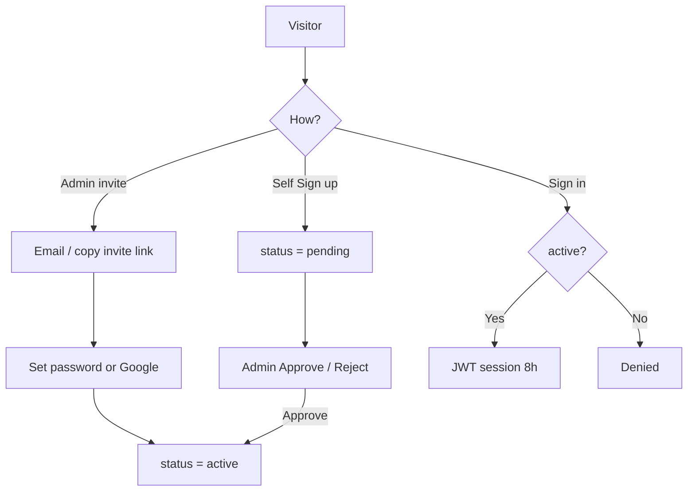
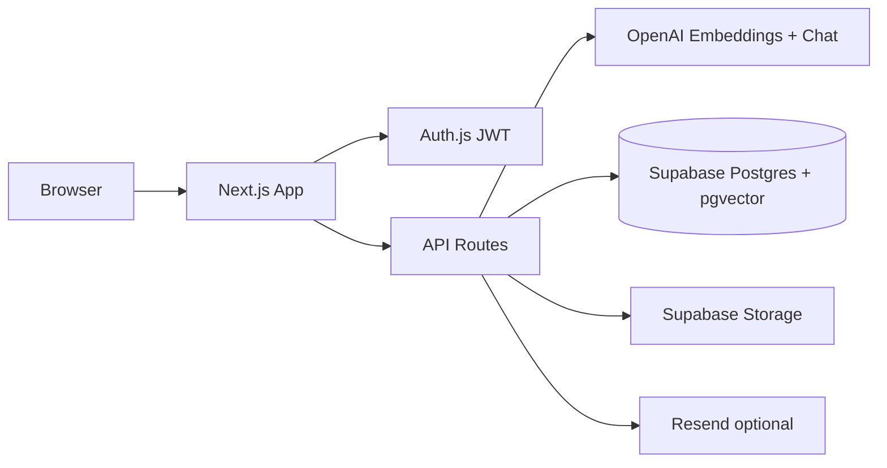

# AI Knowledge Base Assistant

Enterprise **RAG** (Retrieval-Augmented Generation) workspace for internal company documents.

Admins upload PDFs/DOCX → the app indexes them with OpenAI embeddings → signed-in teammates ask natural questions → answers stay **grounded in your docs** with citations (document + page + snippet).

**Stack:** Next.js 16 · React 19 · Tailwind 4 · Auth.js · Supabase (Postgres + pgvector + Storage) · OpenAI · optional Resend

---

## What this product is

| For | Job |
|-----|-----|
| **Admin** | Own the company knowledge base: upload/reindex/delete docs, collections, invites & access approvals, analytics |
| **Assistant** | Use the shared knowledge base: browse docs, semantic search, cited chat — no uploads, no admin panel |

Access is **invite- or approval-gated**. Random Google signups do not get in.

---

## Why RAG?

Plain ChatGPT does not know your company policies unless you paste them into every prompt.

| Approach | Problem |
|----------|---------|
| GPT only (no docs) | Hallucinates; invents policies |
| Stuff full PDFs into every prompt | Expensive, slow; weak page-level citations |
| Keyword search only | Misses “annual leave” vs “vacation policy” |

**RAG** flow:

1. **Retrieve** relevant chunks from *your* indexed documents (embeddings + pgvector).
2. **Augment** the LLM prompt with only those chunks.
3. **Generate** an answer faithful to that context, with inline sources.

Casual messages (`hi`, `thanks`, …) are answered **locally** — no OpenAI tokens.

---

## App pages

| Page | Route | Who | What |
|------|--------|-----|------|
| **Sign in** | `/login` | Public | Email/password or Google (invited/active only) |
| **Sign up** | `/signup` | Public | Request access, or accept an admin invite (`?invite=…`) |
| **Dashboard** | `/dashboard` | Signed-in | Intro, semantic search, Knowledge Chat (history, collections, citations) |
| **Documents** | `/document-workspace` | Signed-in | Browse company docs; summarize / extract / ask (admin uploads elsewhere) |
| **Account** | `/account` | Signed-in | Change **display name** and **password** (email locked) |
| **Admin Settings** | `/admin-settings` | Admin only | Upload/reindex/delete, collections, invite/approve users, analytics |

---

## Roles & access control

### Roles

| Role | Capabilities |
|------|----------------|
| **admin** | Upload / delete / reindex KB, collections, users (invite + approve/reject), analytics, Admin Settings |
| **assistant** | Read company KB, search, chat, account settings — **no** upload, **no** Admin Settings |

### User status (`public.users.status`)

| Status | Meaning |
|--------|---------|
| `invited` | Admin invited; user must accept invite (password or Google) |
| `pending` | Self-signup; waiting for admin approval |
| `active` | Full app access |
| `rejected` | Access denied (can request again via signup) |

Only **`active`** users can sign in and use the app.

### Auth flows



| Method | Rule |
|--------|------|
| **Email + password** | Allowed only if `status = active` and `password_hash` is set |
| **Continue with Google** | Allowed only if that email is already `invited` (auto-activates) or `active`. **No open Google signup** |
| **Self Sign up** | Creates `pending` assistant; does **not** create a session |
| **Admin invite** | Creates `invited` user + token; Resend email if configured, else **copy link** in Admin UI |

Display names must be **letters** (spaces / hyphen / apostrophe OK). Values like `123` are rejected.

Sessions last **8 hours** (JWT). Role/status refresh from the DB on requests.

Auth gate: [`src/proxy.ts`](src/proxy.ts). Public: `/login`, `/signup`, `/api/auth/*`, `/api/register`, `/api/invite`.

---

## Architecture



Login is **Auth.js**, not Supabase Auth sessions. App users live in `public.users`; Auth.js may mirror into Supabase Auth for admin tooling.

Do **not** enable Google under Supabase Auth → Providers — this app uses Auth.js Google only.

---

## RAG pipeline

1. **Parse** — PDF (`unpdf`) or DOCX (`mammoth`).
2. **Chunk** — page-aware windows.
3. **Embed** — OpenAI `text-embedding-3-small` → 1536-d vectors.
4. **Store** — `document_chunks` + Storage; `knowledge_base.status` = `processing` → `ready` / `failed`.
5. **Retrieve** — embed question → RPC `match_document_chunks` → relevance filter.
6. **Answer** — grounded system prompt + citations. Off-topic → documentation-only message. Small-talk → local reply (no tokens).

Upload returns after Storage + DB insert; **indexing runs in the background**. Admin UI polls until `ready` / `failed`.

**Knowledge model:** company-shared KB (admin-uploaded). All signed-in users can search/chat. Conversations stay **private per user**.

---

## Features ↔ APIs

| Feature | Route / API | Notes |
|---------|-------------|--------|
| Sign in | `/login` | Credentials + gated Google |
| Sign up / invite accept | `/signup`, `POST /api/register`, `GET|POST /api/invite` | Pending or activate |
| Account | `/account`, `PATCH /api/account` | Name + password; email immutable |
| Invite user | `POST /api/admin/users/invite` | Admin; returns `inviteUrl` |
| Approve / reject | `POST /api/admin/users/[id]/approve\|reject` | Admin |
| Semantic search | `POST /api/search` | Company docs |
| RAG chat | `POST /api/chat` | History + small-talk short-circuit |
| Upload / reindex / delete | Admin document APIs | Admin only |
| Collections | Admin + chat/search scope | `collections`, `collection_documents` |

### Activity & logs

| Store | Purpose |
|-------|---------|
| `activity_logs` | `login_*`, `chat`, `chat_small_talk`, `upload`, … + email/role |
| `search_logs` | Search/chat queries and hits |

View in Supabase Table Editor or **Admin Settings → Usage analytics**.

---

## Database migrations

| File | Purpose |
|------|---------|
| [`005_clean_reset.sql`](supabase/migrations/005_clean_reset.sql) | Recommended full rebuild (UUID schema + RPC + `documents` bucket) |
| [`006_assistant_role_and_activity.sql`](supabase/migrations/006_assistant_role_and_activity.sql) | `assistant` role, `activity_logs`, enriched `search_logs` |
| [`007_user_access_status.sql`](supabase/migrations/007_user_access_status.sql) | **Required for invite/pending:** `status`, invite tokens, approval fields |

Older `001`–`004*` scripts are historical repair paths. Prefer `005` → `006` → `007` on a fresh or reset project.

**Core tables:** `users`, `knowledge_base`, `document_chunks`, `conversations`, `messages`, `collections`, `collection_documents`, `search_logs`, `activity_logs`  
**Storage:** private bucket `documents` (PDF/DOCX, 20MB)  
**RPC:** `match_document_chunks`

Runtime uses the **Supabase service-role** client (server-only).

---

## Environment

Copy [`.env.example`](.env.example) → `.env.local`:

| Variable | Purpose |
|----------|---------|
| `AUTH_SECRET` | Auth.js signing (≥32 chars) |
| `AUTH_URL` | App URL — localhost locally; **production Vercel URL** on Vercel |
| `ENCRYPTION_KEY` | AES-256-GCM for storage paths (64 hex chars) |
| `NEXT_PUBLIC_SUPABASE_URL` | Supabase project URL |
| `SUPABASE_SERVICE_ROLE_KEY` | Server DB + Storage + Auth Admin (**never in browser**) |
| `OPENAI_API_KEY` | Embeddings + chat + summarize/extract |
| `OPENAI_CHAT_MODEL` | Default `gpt-4o-mini` |
| `OPENAI_EMBEDDING_MODEL` | Default `text-embedding-3-small` |
| `GOOGLE_CLIENT_ID` / `GOOGLE_CLIENT_SECRET` | Google SSO button |
| `RESEND_API_KEY` / `EMAIL_FROM` | Optional invite/approval emails |

Optional seed: `SEED_ADMIN_EMAIL`, `SEED_ADMIN_PASSWORD`, `SEED_ADMIN_NAME`.

**Resend note:** With `onboarding@resend.dev` you can only email the Resend account owner. To email arbitrary Gmail addresses, verify your own domain in Resend and set `EMAIL_FROM` to that domain. Until then, admins **copy the invite link** from Admin Settings.

Never commit `.env.local`.

---

## Setup (from zero)

### 1. Env

1. Create a [Supabase](https://supabase.com/dashboard) project.
2. Copy Project URL + **service_role** key into `.env.local`.
3. Add Auth secret, encryption key, OpenAI, optional Google / Resend.

### 2. Database

In Supabase **SQL Editor**, paste **file contents** (not paths), in order:

1. [`005_clean_reset.sql`](supabase/migrations/005_clean_reset.sql)  
2. [`006_assistant_role_and_activity.sql`](supabase/migrations/006_assistant_role_and_activity.sql)  
3. [`007_user_access_status.sql`](supabase/migrations/007_user_access_status.sql)

Confirm `users.status` exists and roles are `admin` | `assistant`.

### 3. Install & run

```bash
npm install
npm run seed:admin
npm run dev
```

Open [http://localhost:3000/login](http://localhost:3000/login).

| Login | Default |
|-------|---------|
| Seed admin | `admin@example.com` / `ChangeMeNow1!` → **admin** + `active` |

After `.env.local` changes, fully restart `npm run dev`.

### 4. Smoke test

1. Admin login → **Admin Settings** visible.  
2. Upload PDF/DOCX → wait until `ready`.  
3. Dashboard → search + chat (try `hi` — should not call OpenAI).  
4. Invite a user → copy link → accept on `/signup?invite=…`.  
5. Assistant login → Documents + chat; no Admin Settings / upload.  
6. Account → change name/password (letters-only name).

### Google OAuth

1. [Google Cloud Console](https://console.cloud.google.com/) → OAuth Web client.  
2. Origins + redirect for localhost and production Vercel URL (`/api/auth/callback/google`).  
3. Put Client ID/Secret in env and restart.  
4. Google only works for **invited or already active** emails.

---

## Deploy on Vercel

1. Connect GitHub repo → Framework **Next.js**.  
2. Set the same env vars as local; **`AUTH_URL` must be** `https://YOUR_APP.vercel.app`.  
3. Add production Google OAuth origins/redirects.  
4. Optionally add `RESEND_API_KEY` + `EMAIL_FROM`.  
5. Deploy, then run `npm run seed:admin` against the same Supabase project if needed.  
6. Ensure migration **007** has been applied on that database.

**Notes:** Hobby plan has smaller upload body limits than the app’s 20MB local cap. Redeploy after env changes.

---

## Troubleshooting

| Symptom | Fix |
|---------|-----|
| Invite/signup status errors / missing `status` | Run [`007_user_access_status.sql`](supabase/migrations/007_user_access_status.sql) |
| `admin@example.com` invalid credentials | `npm run seed:admin` |
| Google AccessDenied | User not invited/active, or OAuth/env misconfigured |
| Invite email not arriving | Resend test sender limit, or no domain verified — copy invite link |
| Assistant sees Admin Settings | Should not — check `role`; Admin button is admin-only |
| Chat “I can only answer…” | Question not related to indexed docs, or KB empty |
| PDF indexing fails on Vercel | App uses `unpdf`; check document `error_message` |
| Paste SQL path error | Paste file **contents** into SQL Editor |

---

## Folder map

```
src/
  proxy.ts                 # Auth gate + security headers
  auth.config.ts           # Edge-safe Auth.js config
  app/
    login/ signup/
    (app)/                 # dashboard, documents, account, admin-settings
    api/                   # chat, search, documents, account, invite, register, admin
  components/              # chat, search, document, admin, account, auth, sidebar, ui
  lib/
    auth.ts activity.ts session.ts
    chat/small-talk.ts     # Token-free greetings/thanks
    access-control.ts email.ts
    openai/rag.ts
    documents/             # indexer, chunking, parser, access
    supabase/
supabase/migrations/       # 005 clean reset · 006 activity · 007 access status
scripts/
  seed-admin.ts
  check-db.ts
```

---

## Scripts

| Command | Purpose |
|---------|---------|
| `npm run dev` | Local Next.js (Turbopack) |
| `npm run build` / `npm start` | Production build & serve |
| `npm run seed:admin` | Create/update active email admin |
| `npm run lint` | ESLint |
| `npx tsx scripts/check-db.ts` | Health check tables / RPC / admin |

---

## Security (summary)

- Invite / pending / active / rejected access model  
- JWT sessions (8h) · RBAC · bcrypt passwords  
- Google gated to invited/active emails  
- Alphabetic display names · email immutable on account page  
- Zod validation · rate limits · AES storage path encryption  
- Private Storage · service-role server-only · security headers  

---

## License

Private project — all rights reserved unless otherwise stated.
