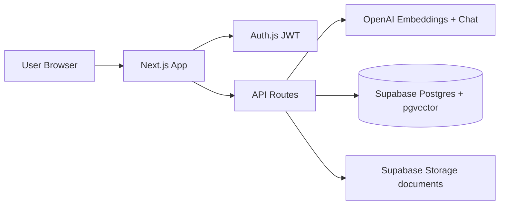

# AI Knowledge Base

Enterprise **RAG** (Retrieval-Augmented Generation) knowledge assistant for internal company documents.

Upload PDFs/DOCX → index with OpenAI embeddings → ask natural questions → get **grounded answers with citations** (document + page + snippet).

**Stack:** Next.js 16 · React 19 · Tailwind 4 · Auth.js · Supabase (Postgres + pgvector + Storage) · OpenAI

---

## Why RAG?

Plain ChatGPT **does not know your company policies** unless you paste them into every prompt (which is insecure, incomplete, and does not scale).

| Approach | Problem |
|----------|---------|
| GPT only (no docs) | Hallucinates; invents policies from public knowledge |
| Stuff full PDFs into every prompt | Too large, expensive, slow; no page-level citations |
| Keyword search only | Misses phrasing like “annual leave” vs “vacation policy” |

**RAG** solves this:

1. **Retrieve** the most relevant chunks from *your* indexed documents (semantic search via embeddings + pgvector).
2. **Augment** the LLM prompt with only those chunks.
3. **Generate** an answer that must stay faithful to that context, with inline sources.

So employees get fast, source-backed answers instead of hunting through folders — and admins keep control over what is in the knowledge base.

---

## What we built (product overview)

| Area | What it does |
|------|----------------|
| **Login** | Email/password (bcrypt). Optional Google OAuth if envs are set. 15-minute JWT sessions. Roles: `viewer` / `admin`. |
| **Dashboard** | Product intro + **knowledge chat**: collections scope, conversation history, citations, confidence, follow-ups, export/copy. |
| **Document workspace** | Pick one doc → summarize, extract metadata, or ask scoped questions. |
| **Admin settings** | Upload/reindex/delete documents, collections, create users, usage analytics. |
| **UI** | Teal + amber theme, dark mode, full-height collapsible sidebar, Framer Motion animations, brand logo + intro imagery. |

### Roles

- **Viewer** — chat, search, document workspace, open source files.
- **Admin** — everything above + upload/index, collections, users, analytics (`/admin-settings`).

---

## Architecture (how pieces connect)



### RAG pipeline (current implementation)

1. **Parse** — PDF page-by-page (`pdf-parse`) or DOCX (`mammoth`).
2. **Chunk** — page-aware word windows (~250 words, 40 overlap).
3. **Embed** — OpenAI `text-embedding-3-small` → 1536-d vectors.
4. **Store** — rows in `document_chunks` + file in Storage; status on `knowledge_base`.
5. **Retrieve** — embed the question → RPC `match_document_chunks` → keep matches with cosine distance ≤ 0.8.
6. **Answer** — GPT uses only retrieved context; greetings allowed without fake citations; otherwise cite `(Source: file, Page N)`.

Auth gate runs in [`src/proxy.ts`](src/proxy.ts) (Next.js 16 proxy convention). Login and `/api/auth/*` are excluded from the Auth.js wrapper so routes do not 404.

---

## Functionalities ↔ APIs ↔ database / storage

| Feature | Main routes / UI | Primary data |
|---------|------------------|--------------|
| Sign in / session | `/login`, `/api/auth/[...nextauth]` | `users` (+ Auth.js JWT cookie) |
| RAG chat | Dashboard → `POST /api/chat` | `document_chunks`, `conversations`, `messages`, `search_logs` |
| Semantic search | `POST /api/search` | `document_chunks` via `match_document_chunks` |
| Suggestions | `GET /api/suggestions` | derived from KB / heuristics |
| Conversations | `/api/conversations` | `conversations`, `messages` |
| Collections | `/api/collections` | `collections`, `collection_documents` |
| Upload + index | Admin → `POST /api/documents` | Storage bucket `documents` + `knowledge_base` + `document_chunks` |
| Reindex / delete / file URL | `/api/documents/[id]/*` | Storage + `knowledge_base` / chunks |
| Summarize / extract | Document workspace APIs | chunks → OpenAI |
| Users | `GET/POST /api/admin/users` | `users` |
| Analytics | `GET /api/admin/analytics` | `search_logs` (+ related) |

### Core Supabase tables (migrations)

Defined in [`supabase/migrations/001_initial.sql`](supabase/migrations/001_initial.sql) and [`002_feature_wave.sql`](supabase/migrations/002_feature_wave.sql):

| Table / object | Purpose |
|----------------|---------|
| `users` | App accounts, roles, password hashes |
| `knowledge_base` | Document metadata + status (`processing` / `ready` / `failed`) |
| `document_chunks` | Text + `page_number` + `embedding vector(1536)` |
| `match_document_chunks` | pgvector similarity RPC (optional collection/doc filters) |
| `collections` / `collection_documents` | Scope chat/search to a doc set |
| `conversations` / `messages` | Chat history + stored citations/confidence |
| `search_logs` | Usage analytics |
| Storage bucket `documents` | Private originals; short-lived signed URLs for viewing |

`prisma/schema.prisma` documents the model shape; **runtime reads/writes go through the Supabase service-role client**, not Prisma at request time.

---

## Environment keys — what each one is for

Copy [`.env.example`](.env.example) → `.env.local`:

| Variable | Related to | Used for |
|----------|------------|----------|
| `AUTH_SECRET` | Auth.js | Signing JWT sessions (min 32 chars) |
| `AUTH_URL` | Auth.js | App URL (e.g. `http://localhost:3000`) |
| `ENCRYPTION_KEY` | Security | AES-256-GCM encryption of stored file paths (64 hex chars) |
| `NEXT_PUBLIC_SUPABASE_URL` | Supabase | Project API URL |
| `SUPABASE_SERVICE_ROLE_KEY` | Supabase | Server-side DB + Storage (bypass RLS; **server only**) |
| `OPENAI_API_KEY` | OpenAI | Embeddings + chat + summarize/extract |
| `OPENAI_CHAT_MODEL` | OpenAI | Default `gpt-4o-mini` |
| `OPENAI_EMBEDDING_MODEL` | OpenAI | Default `text-embedding-3-small` |
| `GOOGLE_CLIENT_ID` / `GOOGLE_CLIENT_SECRET` | Optional OAuth | Google sign-in (user must already exist in `users`) |

No secrets belong in git — only `.env.example` is committed.

---

## Folder map

```
src/
  proxy.ts                 # Auth + security headers (Next.js 16)
  auth.config.ts           # Edge-safe Auth.js config
  app/
    login/                 # Animated branded login
    (app)/                 # Shell: collapsible sidebar + pages
      dashboard/
      document-workspace/
      admin-settings/
    api/                   # chat, search, documents, conversations, collections, admin
  components/
    brand/ chat/ dashboard/ sidebar/ document/ admin/ uploader/ ui/
  lib/
    auth.ts openai/rag.ts documents/{indexer,chunking,document-parser}.ts
    supabase/ security/ validations.ts
public/images/             # Intro / hero illustrations
supabase/migrations/
scripts/seed-admin.ts
```

---

## Setup

1. **Supabase** — run both SQL migrations in the SQL Editor. Create private Storage bucket `documents` if the migration does not.
2. **Env** — fill `.env.local` from `.env.example`.
3. **Install & run**
   ```bash
   npm install
   npm run seed:admin
   npm run dev
   ```
4. Open [http://localhost:3000/login](http://localhost:3000/login)  
   Default admin: `admin@example.com` / `ChangeMeNow1!` (change in production).
5. **Admin** → upload a PDF/DOCX → wait until status is `ready` → **Dashboard** → ask a question.  
   Reindex old docs after chunking upgrades so `page_number` citations populate.

---

## Security (summary)

- Short JWT sessions · RBAC (`viewer` / `admin`) · bcrypt passwords  
- Zod validation · rate limits on sensitive APIs · AES file-path encryption  
- Private Storage + service-role server access · security headers via proxy  

---

## Work completed in this codebase

High-level delivery checklist:

- [x] Auth.js credentials (+ optional Google) with role-based routes  
- [x] Document upload → parse → page-aware chunk → embed → pgvector store  
- [x] Dashboard RAG chat with citations, confidence, follow-ups, conversation history  
- [x] Collections scoping · document workspace (summarize / extract / ask)  
- [x] Admin users, collections, reindex, analytics  
- [x] Safa-style RAG upgrades (page numbers, distance cutoff, grounded prompt)  
- [x] Premium UI: design tokens, dark mode, collapsible full-height sidebar, intro content + images  
- [x] Dark-theme-safe forms/panels (no hard-coded white inputs on Admin/Dashboard)  

---

## Scripts

| Command | Purpose |
|---------|---------|
| `npm run dev` | Local Next.js (Turbopack) |
| `npm run build` / `npm start` | Production build & serve |
| `npm run seed:admin` | Create/update default admin user |
| `npm run lint` | ESLint |

---

## License

Private project — all rights reserved unless otherwise stated.
