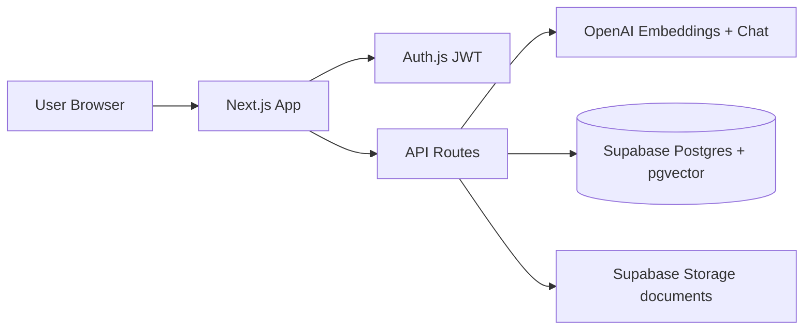
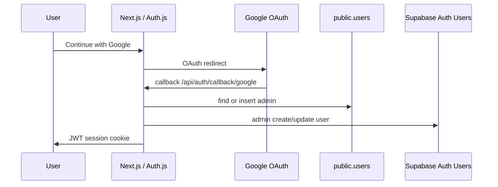

# AI Knowledge Base

Enterprise **RAG** (Retrieval-Augmented Generation) knowledge assistant for internal company documents.

Upload PDFs/DOCX → index with OpenAI embeddings → ask natural questions → get **grounded answers with citations** (document + page + snippet).

**Stack:** Next.js 16 · React 19 · Tailwind 4 · Auth.js · Supabase (Postgres + pgvector + Storage) · OpenAI

---

## Why RAG?

Plain ChatGPT **does not know your company policies** unless you paste them into every prompt (insecure, incomplete, does not scale).

| Approach | Problem |
|----------|---------|
| GPT only (no docs) | Hallucinates; invents policies from public knowledge |
| Stuff full PDFs into every prompt | Too large, expensive, slow; no page-level citations |
| Keyword search only | Misses phrasing like “annual leave” vs “vacation policy” |

**RAG** solves this:

1. **Retrieve** the most relevant chunks from *your* indexed documents (embeddings + pgvector).
2. **Augment** the LLM prompt with only those chunks.
3. **Generate** an answer that stays faithful to that context, with inline sources.

---

## App pages (sidebar)

| Page | Route | What you can do |
|------|--------|-----------------|
| **Dashboard** | `/dashboard` | Intro, **semantic search**, Knowledge Chat (history, collections, citations, confidence, copy/export) |
| **Documents** | `/document-workspace` | Pick a file → **Summarize**, **Extract metadata**, or ask questions scoped to that document |
| **Admin Settings** | `/admin-settings` | Upload/reindex/delete docs, collections, users, usage analytics |

### Roles

- **Admin** — all pages (upload + users + analytics). Google SSO users are provisioned as **admin** in this project so Admin Settings is visible after login.
- **Viewer** — Dashboard + Documents only (no Admin Settings). Can be created manually in Admin → Users.

Sessions last **8 hours** (JWT). Role is refreshed from the database so permission changes apply on the next request.

---

## Architecture



### Google SSO (Auth.js → Supabase mirror)

Google login uses **Auth.js**, not Supabase’s built-in Google provider.

1. OAuth callback → find or create `public.users` (role `admin`, no password hash).
2. Mirror into **Supabase → Authentication → Users** via service-role Admin API (`provider: google`).
3. Issue Auth.js JWT session.



### RAG pipeline

1. **Parse** — PDF page-by-page (`pdf-parse`) or DOCX (`mammoth`).
2. **Chunk** — page-aware windows (~250 words, 40 overlap).
3. **Embed** — OpenAI `text-embedding-3-small` (batched, 96 inputs) → 1536-d vectors.
4. **Store** — `document_chunks` + Storage object; `knowledge_base.status` = `processing` → `ready` / `failed`.
5. **Retrieve** — embed the question → RPC `match_document_chunks` → keep cosine distance ≤ **0.55**.
6. **Answer** — multi-turn history (last turns) + grounded system prompt; greetings allowed without fake citations.

Upload returns immediately after Storage + DB insert; **indexing runs in the background**. The uploader polls until `ready` or `failed`.

Auth gate: [`src/proxy.ts`](src/proxy.ts). Login and `/api/auth/*` are excluded so Auth.js routes do not 404.

---

## Features ↔ APIs ↔ data

| Feature | UI / route | Data |
|---------|------------|------|
| Login | `/login`, `/api/auth/[...nextauth]` | `users` + JWT; Google mirrored to Supabase Auth |
| Semantic search | Dashboard `SearchBar` → `POST /api/search` | `document_chunks` |
| RAG chat | Dashboard → `POST /api/chat` | `conversations`, `messages`, `search_logs` |
| Document workspace | Summarize / extract / scoped chat | chunks → OpenAI |
| Upload + index | Admin → `POST /api/documents` | Storage `documents` + `knowledge_base` + chunks |
| Collections | Admin + chat/search scope | `collections`, `collection_documents` |
| Users / analytics | Admin | `users`, `search_logs` |

### Database (migrations)

| File | Purpose |
|------|---------|
| [`001_initial.sql`](supabase/migrations/001_initial.sql) | Extensions, `users`, KB, chunks, search RPC, storage bucket |
| [`002_feature_wave.sql`](supabase/migrations/002_feature_wave.sql) | Conversations, messages, collections, enriched logs |
| [`005_clean_reset.sql`](supabase/migrations/005_clean_reset.sql) | **Recommended** full rebuild if schema is broken (CUID/`text` ids, missing tables) |

`users.id` **must be `uuid`**. Non-UUID ids (e.g. Prisma CUIDs) break foreign keys for chat.

Runtime uses the **Supabase service-role client** (not Prisma at request time). `prisma/schema.prisma` documents the model shape only.

---

## Environment

Copy [`.env.example`](.env.example) → `.env.local`:

| Variable | Used for |
|----------|----------|
| `AUTH_SECRET` | Auth.js signing (≥32 chars) |
| `AUTH_URL` | App URL (`http://localhost:3000`) |
| `ENCRYPTION_KEY` | AES-256-GCM for storage paths (64 hex chars) |
| `NEXT_PUBLIC_SUPABASE_URL` | Supabase project URL |
| `SUPABASE_SERVICE_ROLE_KEY` | Server DB + Storage + Auth Admin (**never expose to browser**) |
| `OPENAI_API_KEY` | Embeddings + chat + summarize/extract |
| `OPENAI_CHAT_MODEL` | Default `gpt-4o-mini` |
| `OPENAI_EMBEDDING_MODEL` | Default `text-embedding-3-small` |
| `GOOGLE_CLIENT_ID` / `GOOGLE_CLIENT_SECRET` | Optional Google SSO button |

Never commit `.env.local`.

---

## Setup (from zero)

### 1. Env

1. Create a [Supabase](https://supabase.com/dashboard) project.
2. **Settings → API** → copy Project URL + **service_role** key.
3. Fill `.env.local` (Auth secret, encryption key, OpenAI, Supabase, optional Google).

### 2. Database

In **SQL Editor**, paste **file contents** (not the path).

**Fresh or broken project (recommended):**

1. Open [`005_clean_reset.sql`](supabase/migrations/005_clean_reset.sql) → copy all → Run once.  
   - Renames a broken `users` table to `users_legacy_backup`  
   - Creates the full UUID schema + grants + `match_document_chunks` + `documents` bucket  

**Or stepwise on a clean empty DB:**

1. Run [`001_initial.sql`](supabase/migrations/001_initial.sql)  
2. Run [`002_feature_wave.sql`](supabase/migrations/002_feature_wave.sql)  
3. Run grants (also included in `005`):

```sql
grant usage on schema public to postgres, anon, authenticated, service_role;
grant all on all tables in schema public to postgres, anon, authenticated, service_role;
grant all on all sequences in schema public to postgres, anon, authenticated, service_role;
grant all on all routines in schema public to postgres, anon, authenticated, service_role;
```

Confirm **Table Editor**: `users`, `knowledge_base`, `document_chunks`, `conversations`, `messages`, `collections`.  
Confirm `users.id` type is **uuid**.

### 3. Install & run

```bash
npm install
npm run seed:admin
npm run dev
```

Open [http://localhost:3000/login](http://localhost:3000/login).

| Login | Credentials |
|-------|-------------|
| Email admin | `admin@example.com` / `ChangeMeNow1!` |
| Google | Continue with Google (after Client ID/Secret are set) |

After any `.env.local` change, **fully restart** `npm run dev` (avoid a second server on port 3001).

### 4. Smoke test

1. Sidebar: **Dashboard**, **Documents**, **Admin Settings**.
2. **Admin Settings** → upload PDF/DOCX → wait until status is `ready`.
3. **Dashboard** → semantic search + Knowledge Chat (`hello` works as a greeting).
4. **Documents** → Summarize / Extract / ask on a ready file.

### Google SSO setup

1. [Google Cloud Console](https://console.cloud.google.com/) → OAuth consent screen.  
2. Credentials → OAuth client **Web application**:
   - Origins: `http://localhost:3000`
   - Redirect: `http://localhost:3000/api/auth/callback/google`
3. Put Client ID + Secret in `.env.local`, restart.  
4. Do **not** enable Google under Supabase Auth → Providers (not used by this app).

Verify: **Authentication → Users** and **Table Editor → users** show the Google email after first login.

---

## Troubleshooting

| Symptom | Cause | Fix |
|---------|--------|-----|
| SQL error near `"supabase"` | Pasted file **path** | Paste SQL **contents** only |
| `unterminated dollar-quoted string` + injected RLS | Supabase editor injects RLS into `$$` bodies | Use `005_clean_reset.sql` (tagged `$fn$`) or run smaller scripts |
| `invalid input syntax for type uuid: "cmrz…"` | `users.id` is CUID/`text` | Run [`005_clean_reset.sql`](supabase/migrations/005_clean_reset.sql) |
| `conversations` / FK uuid vs text | Incomplete or wrong schema | Run `005_clean_reset.sql` |
| `permission denied for schema public` | Missing grants | Run grant SQL above |
| `column users.password_hash does not exist` | Incomplete `users` table | Run `005` or add the column, then re-seed |
| Google → AccessDenied | DB insert/select failed | Check terminal `Google sign-in failed:`; fix schema; restart server |
| No Admin Settings in sidebar | Session still `viewer` | Sign out → Google again (promotes to admin), or `update public.users set role = 'admin';` then re-login |
| Chat “Internal server error” | Missing `conversations` table | Run `002` or `005` |
| Documents page empty | No uploads yet | Admin → upload until `ready` |
| PDF citation iframe blank | CSP | App sets `frame-src` for `*.supabase.co` (already in code) |

---

## Production-oriented behavior (shipped)

- Route `loading.tsx` / `error.tsx` / `global-error.tsx`
- Background document indexing + client status polling
- Chat: auto-scroll, stop, retry, 401 → login, multi-turn history
- Search mounted on Dashboard with empty/no-results states
- Upload: rejected-file messages, clearer progress stages
- API: JSON body guard (400), `Retry-After` on 429, clearer PostgREST logs
- Doc viewer: dialog semantics, Escape, backdrop close
- CSP allows Supabase Storage frames for PDF preview

---

## Folder map

```
src/
  proxy.ts                 # Auth + security headers
  auth.config.ts           # Edge-safe Auth.js (session length)
  app/
    login/
    (app)/                 # Dashboard · Documents · Admin
      loading.tsx error.tsx
    api/                   # chat, search, documents, conversations, collections, admin
    global-error.tsx
  components/              # chat, search, document, admin, uploader, sidebar, ui
  lib/
    auth.ts http.ts client-api.ts api.ts session.ts
    openai/ rag.ts client.ts
    documents/ indexer, chunking, parser
    supabase/ admin.ts auth-users.ts
supabase/migrations/       # 001, 002, 005_clean_reset, …
scripts/seed-admin.ts
```

---

## Scripts

| Command | Purpose |
|---------|---------|
| `npm run dev` | Local Next.js (Turbopack) |
| `npm run build` / `npm start` | Production build & serve |
| `npm run seed:admin` | Create/update `admin@example.com` |
| `npm run lint` | ESLint |

---

## Security (summary)

- JWT sessions (8h) · RBAC · bcrypt passwords  
- Google SSO via Auth.js · mirrored to Supabase Auth  
- Zod validation · in-memory rate limits · AES path encryption  
- Private Storage · service-role server-only · security headers via proxy  

---

## License

Private project — all rights reserved unless otherwise stated.
